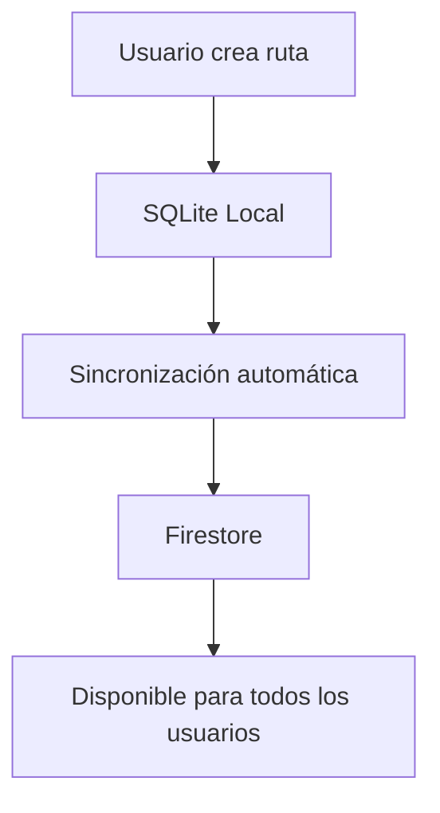
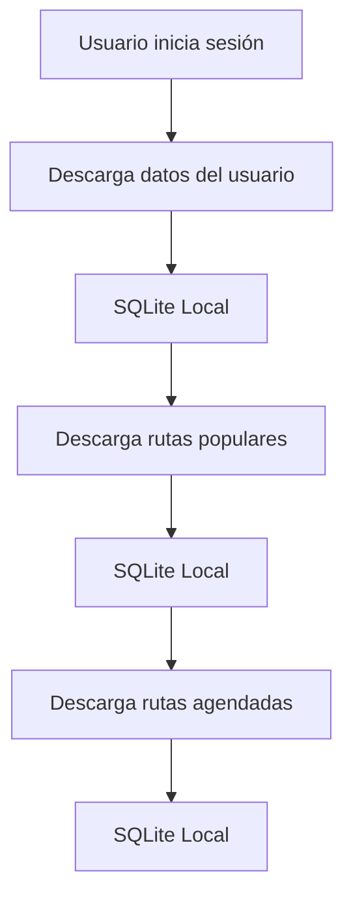
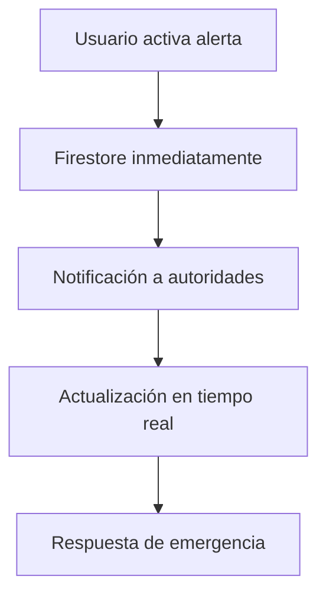

# DESCRIPCIÓN DE COLECCIONES DE BASE DE DATOS - TREK-KING

## ÍNDICE
1. [Introducción](#1-introducción)
2. [Base de Datos Local (SQLite)](#2-base-de-datos-local-sqlite)
3. [Base de Datos en la Nube (Firestore)](#3-base-de-datos-en-la-nube-firestore)
4. [Flujo de Datos](#4-flujo-de-datos)
5. [Estrategia de Sincronización](#5-estrategia-de-sincronización)

---

## 1. INTRODUCCIÓN

La aplicación Trek-King utiliza una arquitectura híbrida con dos bases de datos:

- **SQLite Local**: Almacena datos críticos para funcionamiento offline
- **Firestore**: Almacena datos maestros y permite sincronización en la nube

---

## 2. BASE DE DATOS LOCAL (SQLITE)

### 2.1 Colección: USERS

**Propósito**: Almacena información de usuarios autenticados localmente para acceso rápido y funcionamiento offline.

**Estructura**:
```sql
CREATE TABLE users (
    id VARCHAR(50) PRIMARY KEY,
    email VARCHAR(100) NOT NULL UNIQUE,
    password VARCHAR(255) NOT NULL,
    nombre VARCHAR(100) NOT NULL,
    apellido VARCHAR(100) NOT NULL,
    photo VARCHAR(500),
    rut VARCHAR(20) NOT NULL,
    created_at TIMESTAMP DEFAULT CURRENT_TIMESTAMP,
    updated_at TIMESTAMP DEFAULT CURRENT_TIMESTAMP
);
```

**Datos almacenados**:
- Información de perfil del usuario autenticado
- Credenciales de acceso (encriptadas)
- Datos de identificación personal (RUT, nombre, apellido)
- Foto de perfil (URL)

**Casos de uso**:
- Autenticación offline
- Acceso rápido a datos del usuario
- Funcionamiento sin conexión
- Cache de información de sesión

**Volumen estimado**: 1 registro por usuario autenticado

---

### 2.2 Colección: AUTORIDADES

**Propósito**: Almacena información de autoridades autenticadas para gestión de emergencias y supervisión.

**Estructura**:
```sql
CREATE TABLE autoridades (
    id VARCHAR(50) PRIMARY KEY,
    email VARCHAR(100) NOT NULL UNIQUE,
    nombre VARCHAR(100) NOT NULL,
    password VARCHAR(255),
    img VARCHAR(500),
    role VARCHAR(50),
    zona VARCHAR(50),
    cargo VARCHAR(100),
    institucion VARCHAR(100),
    created_at TIMESTAMP DEFAULT CURRENT_TIMESTAMP,
    updated_at TIMESTAMP DEFAULT CURRENT_TIMESTAMP
);
```

**Datos almacenados**:
- Información de perfil de la autoridad
- Credenciales de acceso
- Datos institucionales (cargo, zona, institución)
- Foto de perfil (URL)

**Casos de uso**:
- Autenticación de autoridades
- Gestión de alertas de emergencia
- Supervisión de actividades
- Acceso offline a datos de autoridad

**Volumen estimado**: 1 registro por autoridad autenticada

---

### 2.3 Colección: RUTAS

**Propósito**: Almacena rutas de senderismo y trekking para acceso rápido y funcionamiento offline.

**Estructura**:
```sql
CREATE TABLE rutas (
    id VARCHAR(50) PRIMARY KEY,
    nombre VARCHAR(200) NOT NULL,
    foto VARCHAR(500),
    imagen VARCHAR(500) NOT NULL,
    descripcion TEXT,
    ubicacion VARCHAR(200) NOT NULL,
    dificultad VARCHAR(50) NOT NULL,
    localidad VARCHAR(100),
    categorias TEXT NOT NULL, -- JSON array como string
    caracteristicas TEXT, -- JSON object como string
    puntos_interes TEXT, -- JSON array como string
    creador_id VARCHAR(50),
    creador_nombre VARCHAR(100),
    creador_email VARCHAR(100),
    punto_inicio_lat DECIMAL(10,8),
    punto_inicio_lng DECIMAL(11,8),
    punto_inicio_direccion VARCHAR(200),
    punto_termino_lat DECIMAL(10,8),
    punto_termino_lng DECIMAL(11,8),
    punto_termino_direccion VARCHAR(200),
    fecha_creacion TIMESTAMP DEFAULT CURRENT_TIMESTAMP,
    ultima_modificacion TIMESTAMP DEFAULT CURRENT_TIMESTAMP,
    FOREIGN KEY (creador_id) REFERENCES users(id) ON DELETE SET NULL
);
```

**Datos almacenados**:
- Información básica de la ruta (nombre, descripción, ubicación)
- Metadatos (dificultad, categorías, localidad)
- Recursos multimedia (imágenes)
- Información geográfica (coordenadas de inicio y fin)
- Características técnicas (tipo de terreno, recomendaciones)
- Puntos de interés con descripciones e imágenes
- Información del creador
- Fechas de creación y modificación

**Casos de uso**:
- Exploración de rutas offline
- Visualización de detalles de ruta
- Búsqueda y filtrado local
- Navegación sin conexión
- Cache de rutas favoritas

**Volumen estimado**: 50-200 registros (rutas populares y favoritas del usuario)

---

### 2.4 Colección: RUTAS_AGENDADAS

**Propósito**: Almacena las rutas que el usuario ha programado para realizar en fechas específicas.

**Estructura**:
```sql
CREATE TABLE rutas_agendadas (
    id VARCHAR(50) PRIMARY KEY,
    user_id VARCHAR(50),
    ruta_id VARCHAR(50) NOT NULL,
    nombre VARCHAR(200) NOT NULL,
    ubicacion VARCHAR(200) NOT NULL,
    dificultad VARCHAR(50) NOT NULL,
    imagen VARCHAR(500) NOT NULL,
    fecha_programada DATE NOT NULL,
    hora_programada TIME NOT NULL,
    descripcion TEXT,
    caracteristicas TEXT, -- JSON object como string
    puntos_interes TEXT, -- JSON array como string
    fecha_agendada TIMESTAMP DEFAULT CURRENT_TIMESTAMP,
    nombre_usuario VARCHAR(100),
    FOREIGN KEY (user_id) REFERENCES users(id) ON DELETE CASCADE,
    FOREIGN KEY (ruta_id) REFERENCES rutas(id) ON DELETE CASCADE
);
```

**Datos almacenados**:
- Referencia a la ruta original
- Información del usuario que agendó
- Fecha y hora programada para la actividad
- Datos duplicados de la ruta para acceso rápido
- Características y puntos de interés de la ruta
- Fecha de agendamiento

**Casos de uso**:
- Gestión de agenda personal
- Recordatorios de actividades programadas
- Planificación de viajes
- Historial de actividades agendadas
- Acceso offline a rutas programadas

**Volumen estimado**: 10-50 registros por usuario (actividades programadas)

---

### 2.5 Colección: PUNTOS_DESCANSO

**Propósito**: Almacena puntos de descanso específicos de cada ruta para navegación detallada.

**Estructura**:
```sql
CREATE TABLE puntos_descanso (
    id INTEGER PRIMARY KEY AUTOINCREMENT,
    ruta_id VARCHAR(50) NOT NULL,
    nombre VARCHAR(100) NOT NULL,
    latitud DECIMAL(10,8) NOT NULL,
    longitud DECIMAL(11,8) NOT NULL,
    descripcion TEXT,
    FOREIGN KEY (ruta_id) REFERENCES rutas(id) ON DELETE CASCADE
);
```

**Datos almacenados**:
- Referencia a la ruta padre
- Nombre del punto de descanso
- Coordenadas geográficas precisas
- Descripción del punto (opcional)

**Casos de uso**:
- Navegación detallada de rutas
- Puntos de referencia durante la actividad
- Planificación de paradas
- Información de seguridad

**Volumen estimado**: 5-20 registros por ruta

---

## 3. BASE DE DATOS EN LA NUBE (FIRESTORE)

### 3.1 Colección: Users

**Propósito**: Almacena todos los usuarios registrados en la plataforma para autenticación y gestión centralizada.

**Estructura**:
```javascript
{
  id: "string",           // Document ID
  email: "string",        // Required, unique
  password: "string",     // Required, encrypted
  nombre: "string",       // Required
  apellido: "string",     // Required
  photo: "string",        // Optional, URL
  rut: "string",          // Required
  createdAt: "timestamp", // Auto-generated
  updatedAt: "timestamp"  // Auto-generated
}
```

**Datos almacenados**:
- Información completa de todos los usuarios registrados
- Credenciales de acceso encriptadas
- Datos de identificación personal
- Fotos de perfil
- Metadatos de creación y actualización

**Casos de uso**:
- Autenticación centralizada
- Gestión de usuarios
- Recuperación de contraseñas
- Análisis de usuarios
- Backup de datos de usuario

**Volumen estimado**: Miles a millones de registros (todos los usuarios de la plataforma)

---

### 3.2 Colección: Autoridades

**Propósito**: Almacena información de todas las autoridades de emergencia y seguridad registradas.

**Estructura**:
```javascript
{
  id: "string",           // Document ID
  email: "string",        // Required, unique
  nombre: "string",       // Required
  password: "string",     // Optional, encrypted
  img: "string",          // Optional, URL
  role: "string",         // Optional
  zona: "string",         // Optional
  cargo: "string",        // Optional
  institucion: "string",  // Optional
  createdAt: "timestamp", // Auto-generated
  updatedAt: "timestamp"  // Auto-generated
}
```

**Datos almacenados**:
- Información completa de todas las autoridades
- Credenciales de acceso
- Datos institucionales y de responsabilidad
- Fotos de perfil
- Metadatos de creación y actualización

**Casos de uso**:
- Autenticación de autoridades
- Gestión de emergencias
- Asignación de responsabilidades geográficas
- Coordinación interinstitucional
- Backup de datos de autoridades

**Volumen estimado**: Cientos a miles de registros (todas las autoridades del país)

---

### 3.3 Colección: Rutas

**Propósito**: Almacena todas las rutas de senderismo y trekking creadas por los usuarios de la plataforma.

**Estructura**:
```javascript
{
  id: "string",           // Document ID
  nombre: "string",       // Required
  foto: "string",         // Optional, URL
  imagen: "string",       // Required, URL
  descripcion: "string",  // Optional
  ubicacion: "string",    // Required
  dificultad: "string",   // Required
  localidad: "string",    // Optional
  categorias: ["string"], // Required, array
  caracteristicas: {      // Optional, object
    tipoTerreno: "string",
    mejorEpoca: "string",
    recomendaciones: "string"
  },
  puntosInteres: [{       // Optional, array of objects
    nombre: "string",
    descripcion: "string",
    imagenes: ["string"]
  }],
  creador: {              // Optional, object
    id: "string",
    nombre: "string",
    email: "string"
  },
  puntosDescanso: [{      // Optional, array of objects
    nombre: "string",
    ubicacion: {
      lat: "number",
      lng: "number"
    },
    descripcion: "string"
  }],
  puntoInicio: {          // Optional, object
    lat: "number",
    lng: "number",
    direccion: "string"
  },
  puntoTermino: {         // Optional, object
    lat: "number",
    lng: "number",
    direccion: "string"
  },
  fechaCreacion: "timestamp",     // Auto-generated
  ultimaModificacion: "timestamp" // Auto-generated
}
```

**Datos almacenados**:
- Información completa de todas las rutas
- Recursos multimedia (imágenes)
- Información geográfica detallada
- Características técnicas y recomendaciones
- Puntos de interés con descripciones e imágenes
- Información del creador
- Metadatos de creación y modificación

**Casos de uso**:
- Exploración de rutas por todos los usuarios
- Búsqueda y filtrado global
- Compartir rutas entre usuarios
- Análisis de rutas populares
- Backup de todas las rutas creadas

**Volumen estimado**: Miles a decenas de miles de registros (todas las rutas de la plataforma)

---

### 3.4 Colección: Comentarios

**Propósito**: Almacena todos los comentarios y calificaciones que los usuarios hacen sobre las rutas.

**Estructura**:
```javascript
{
  id: "string",           // Document ID
  rutaId: "string",       // Required, reference to Rutas
  usuarioId: "string",    // Required, reference to Users
  nombreUsuario: "string", // Required
  texto: "string",        // Required
  calificacion: "number", // Required, 1-5
  fecha: "timestamp"      // Auto-generated
}
```

**Datos almacenados**:
- Referencia a la ruta comentada
- Información del usuario que comentó
- Texto del comentario
- Calificación numérica (1-5 estrellas)
- Fecha del comentario

**Casos de uso**:
- Sistema de reseñas y calificaciones
- Feedback de usuarios sobre rutas
- Análisis de satisfacción
- Moderación de contenido
- Recomendaciones basadas en calificaciones

**Volumen estimado**: Miles a cientos de miles de registros (múltiples comentarios por ruta)

---

### 3.5 Colección: PublicacionesGrupo

**Propósito**: Almacena las publicaciones que los usuarios crean para buscar compañeros de ruta.

**Estructura**:
```javascript
{
  id: "string",           // Document ID
  rutaId: "string",       // Required, reference to Rutas
  nombre: "string",       // Required
  ubicacion: "string",    // Required
  dificultad: "string",   // Required
  imagen: "string",       // Required, URL
  descripcion: "string",  // Required
  caracteristicas: {      // Required, object
    tipoTerreno: "string",
    mejorEpoca: "string",
    recomendaciones: "string"
  },
  puntosInteres: [{       // Required, array of objects
    nombre: "string",
    descripcion: "string",
    imagenes: ["string"]
  }],
  usuarioId: "string",    // Required, reference to Users
  nombreUsuario: "string", // Required
  fecha: "timestamp"      // Auto-generated
}
```

**Datos almacenados**:
- Referencia a la ruta de la publicación
- Información del usuario que publicó
- Datos de la ruta para visualización rápida
- Características y puntos de interés
- Fecha de publicación

**Casos de uso**:
- Búsqueda de compañeros de ruta
- Networking entre usuarios
- Organización de grupos de senderismo
- Compartir experiencias
- Creación de comunidad

**Volumen estimado**: Cientos a miles de registros (publicaciones activas)

---

### 3.6 Colección: ComentariosGrupo

**Propósito**: Almacena los comentarios en las publicaciones de grupo, con soporte para respuestas anidadas.

**Estructura**:
```javascript
{
  id: "string",           // Document ID
  publicacionId: "string", // Required, reference to PublicacionesGrupo
  usuarioId: "string",    // Required, reference to Users
  nombreUsuario: "string", // Required
  texto: "string",        // Required
  fecha: "timestamp",     // Auto-generated
  esRespuesta: "boolean", // Optional
  comentarioPadreId: "string", // Optional, reference to same collection
  respuestas: ["string"]  // Optional, array of comment IDs
}
```

**Datos almacenados**:
- Referencia a la publicación comentada
- Información del usuario que comentó
- Texto del comentario
- Información de respuestas anidadas
- Fecha del comentario

**Casos de uso**:
- Discusiones en publicaciones de grupo
- Respuestas a comentarios específicos
- Moderación de conversaciones
- Análisis de participación
- Creación de hilos de conversación

**Volumen estimado**: Miles a decenas de miles de registros (múltiples comentarios por publicación)

---

### 3.7 Colección: Alertas

**Propósito**: Almacena las alertas de emergencia que los usuarios activan durante sus actividades.

**Estructura**:
```javascript
{
  id: "string",           // Document ID
  userId: "string",       // Required, reference to Users
  nombreUsuario: "string", // Required
  fotoUsuario: "string",  // Optional, URL
  titulo: "string",       // Required
  descripcion: "string",  // Required
  ubicacion: {            // Required, object
    lat: "number",
    lng: "number"
  },
  fecha: "timestamp",     // Auto-generated
  rutUsuario: "string",   // Required
  estado: "string",       // Required: "pendiente", "en proceso", "solucionado"
  instrucciones: "string" // Optional
}
```

**Datos almacenados**:
- Información del usuario que activó la alerta
- Detalles de la emergencia (título, descripción)
- Ubicación geográfica precisa
- Estado de la alerta
- Instrucciones adicionales
- Fecha de activación

**Casos de uso**:
- Sistema de emergencias
- Coordinación con autoridades
- Seguimiento de incidentes
- Análisis de seguridad
- Respuesta rápida a emergencias

**Volumen estimado**: Cientos a miles de registros (alertas activas e históricas)

---

## 4. FLUJO DE DATOS

### 4.1 Sincronización Local → Nube



### 4.2 Sincronización Nube → Local



### 4.3 Flujo de Datos en Tiempo Real



---

## 5. ESTRATEGIA DE SINCRONIZACIÓN

### 5.1 Datos Críticos (Siempre Local)

- **Usuarios autenticados**: Información de sesión
- **Autoridades autenticadas**: Datos de autoridad
- **Rutas agendadas**: Actividades programadas
- **Rutas favoritas**: Rutas guardadas por el usuario

### 5.2 Datos Maestros (Nube con Cache Local)

- **Todas las rutas**: Descargadas según popularidad y preferencias
- **Comentarios**: Sincronizados en tiempo real
- **Publicaciones de grupo**: Actualizadas automáticamente
- **Alertas**: Enviadas inmediatamente a la nube

### 5.3 Estrategia de Cache

```javascript
// Prioridad de descarga
1. Datos del usuario autenticado
2. Rutas agendadas del usuario
3. Rutas populares (top 50)
4. Rutas por categoría favorita
5. Comentarios de rutas guardadas
6. Publicaciones de grupo recientes
```

### 5.4 Resolución de Conflictos

- **Última modificación gana**: Timestamp más reciente
- **Datos locales tienen prioridad**: Para información crítica
- **Sincronización manual**: Para datos importantes
- **Backup automático**: En la nube

---

## 6. VOLUMEN Y ESCALABILIDAD

### 6.1 Estimaciones de Volumen

| Colección | Registros por Usuario | Total Estimado |
|-----------|----------------------|----------------|
| Users | 1 | 10,000 - 100,000 |
| Autoridades | 1 | 1,000 - 5,000 |
| Rutas | 50-200 (cache) | 5,000 - 50,000 |
| Comentarios | 10-50 | 50,000 - 500,000 |
| PublicacionesGrupo | 5-20 | 1,000 - 10,000 |
| ComentariosGrupo | 20-100 | 10,000 - 100,000 |
| Alertas | 1-10 | 1,000 - 10,000 |

### 6.2 Estrategias de Escalabilidad

- **Particionamiento**: Por región geográfica
- **Índices compuestos**: Para consultas complejas
- **Cache inteligente**: Datos más accedidos localmente
- **Compresión**: Para datos históricos
- **Archivado**: Datos antiguos a almacenamiento frío

---

## 7. CONCLUSIONES

La arquitectura de colecciones de Trek-King está diseñada para:

1. **Rendimiento**: Datos críticos siempre disponibles localmente
2. **Escalabilidad**: Estructura preparada para crecimiento masivo
3. **Confiabilidad**: Redundancia entre local y nube
4. **Flexibilidad**: Soporte para diferentes tipos de contenido
5. **Seguridad**: Separación de datos sensibles y públicos
6. **Experiencia de usuario**: Funcionamiento fluido online y offline

Esta estrategia de almacenamiento híbrido permite que la aplicación funcione de manera óptima en cualquier condición de conectividad, proporcionando una experiencia de usuario consistente y confiable. 